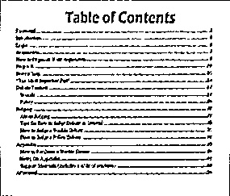

# Document-Scanner
The code implements a powerful document scanner using OpenCV library.

# Dependencies
<ul>
    <li>
        <a href="https://opencv.org/" >OpenCV</a>
    </li>
    <li>
        <a href="https://numpy.org/" >NumPy</a>
    </li>
    <li> 
        <a href="https://scikit-image.org/" >Skimage</a>
    </li> 
</ul>

<b>The code makes the following assumptions :</b>
<ul>
  <li>The document to be scanned is the main focus of the image</li>
  <li>The document (piece of paper) has four edges</li>
</ul>  

#### Input 

#### Output

